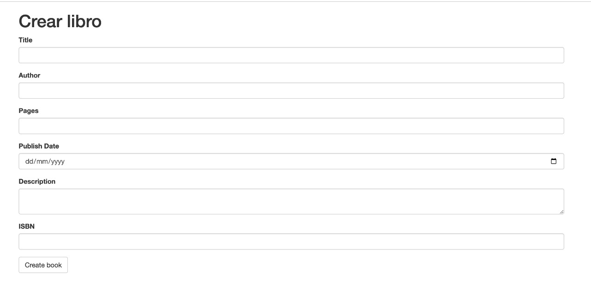
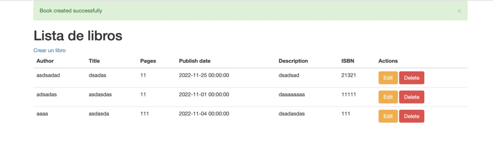

# google-books-nosql
Aplicación Flask de modelamiento de libros con mongodb

## Google Books

Es un servicio de Google que busca el texto completo de libros y revistas que Google tiene en su base de datos digital.


Dicho servicio cuenta con una API: [Google Books APIs](https://developers.google.com/books), nos enfocaremos en el recurso `Volume`.

A continuación un ejemplo de uso de la API mencionada:

```bash
https://www.googleapis.com/books/v1/volumes?q=harry%20potter
```

## Ejercicio

Analizar la respuesta y seleccionar algunos campos para realizar el modelamiento respectivo en MongoDB, así como configurar el registro de libros mediante Flask.

Creación de libro:


Libros registrados:

